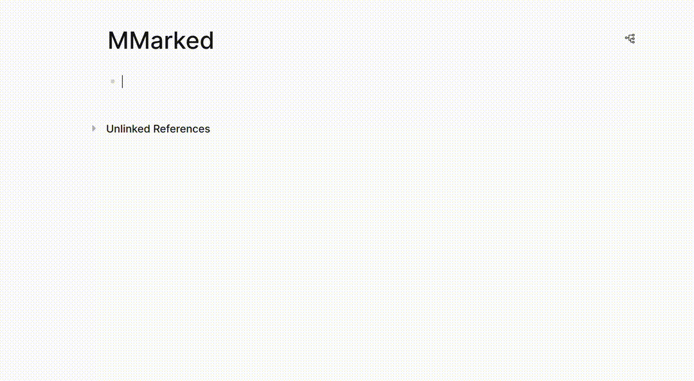

# logseq-mmarked-extenstion

Renders Markdown in Logseq using MMarked.

[中文](./README.zh.md)

This project provide a Logseq plugin provides a block renderer for Markdown using [@mathcrowd/mmarked](https://github.com/mathedu4all/mmarked).

## Usage

To insert music notation, type / and choose `MMarked Block`. It will insert a renderer block, and a notation block below it. Simply type ABC Notation into the notation block, and the notation will render above.

## About MMarked

MMarked support rendering customized markdown syntax designed for mathematical visualization in educational contexts with following features:

- ✅ Full CommonMark Syntax: Comprehensive compatibility with CommonMark standards.
- 🔢 Footnote Block Support: Rendering auto-numbered footnotes with easy reference links.
- 📘 Theorem-like Block Support: Rendering mathematical theorems, lemmas, and examples in a block format with titles, auto-numbering, and reference links.
- 🖼️ Image resizing Capabilities: Allowing for customizable rendering of images and videos using simple syntax.
- 🔍 Hidden/Show Solution Block Support: Provides a solution block with a toggle button for easy visibility control, implemented with straightforward syntax.
- 🧮 TeX to SVG conversion: Converts TeX equations to scalable vector graphics for high-quality rendering.
- 🌗 Dark/Light Theme CSS: Customizable theme support for dark and light modes to enhance readability and user experience.
- ⚡ Real-Time Preview: Enables instant visual feedback while editing, making content creation and adjustments faster and more intuitive.

More info on Product Page: https://lab.mathcrowd.cn/mmarked

## 👥 About Mathcrowd

Mathcrowd is an innovative startup founded by experienced independent developers and mathematics educators. We're on a mission to revolutionize math education in China through cutting-edge technology. Our goal is to create an engaging online community for math enthusiasts and self-learners, offering rich, interactive, and visualized learning content.

🌐 MCLab Official Website: [https://lab.mathcrowd.cn](https://lab.mathcrowd.cn)

🌐 Our Online Math Community: [https://www.mathcrowd.cn](https://www.mathcrowd.cn)

💬 Join Our Discord: https://discord.gg/6VMUVA5Yq2

## 📞 Support

For any questions or issues regarding the MMarked extension, please [open an issue](https://github.com/mathedu4all/mmarked-logseq-extension/issues) on our GitHub repository.

For inquiries specifically related to the @mathcrowd/mmarked library itself, please [open an issue](https://github.com/mathedu4all/mmarked/issues) on its dedicated GitHub repository.
