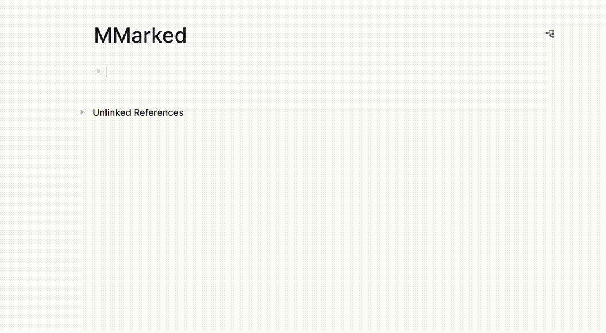
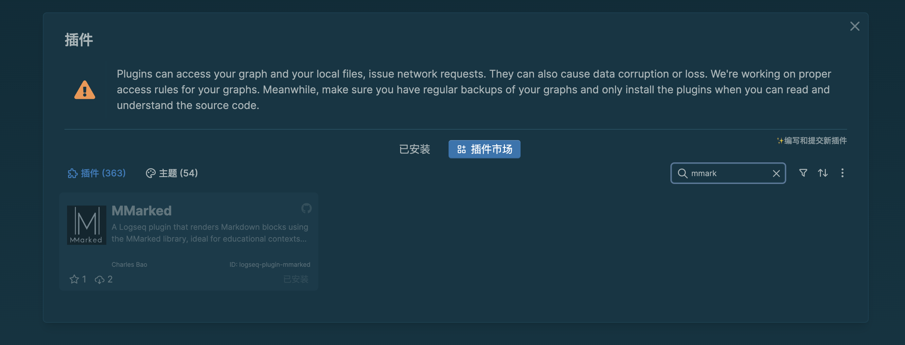

# logseq-mmarked-extension

使用 [@mathcrowd/mmarked](https://github.com/mathedu4all/mmarked) 在 Logseq 中渲染 Markdown。

[English](./README.md)

## 概述

此项目提供了一个 Logseq 插件，使用 MMarked 库渲染 Markdown 区块，特别适用于需要高级 Markdown 功能的教育场景。

## 安装

## 使用方法

要插入 Markdown 区块，可以输入 `/` 并选择 `MMarked Block`，它会创建一个渲染区块，并在其下方生成一个记谱区块。在记谱区块中输入 ABC 记谱内容，渲染效果将显示在上方。

## 关于 MMarked

MMarked 是一个 Markdown 渲染库，支持定制的 Markdown 语法，专为数学可视化的教育场景设计。主要功能包括：

- ✅ **完整的 CommonMark 语法**：全面兼容 CommonMark 标准。
- 🔢 **脚注区块支持**：自动编号的脚注和便捷的参考链接。
- 📘 **定理式区块支持**：提供用于数学定理、引理和示例的专用区块，带有标题、自动编号和引用链接。
- 🖼️ **图像缩放功能**：简单语法实现图像和视频的自定义渲染。
- 🔍 **隐藏/显示解答区块**：提供带有切换按钮的解答区块，方便控制显示与隐藏。
- 🧮 **TeX 转 SVG**：将 TeX 方程转换为高质量的 SVG 格式。
- 🌗 **深色/浅色主题支持**：可定制的主题，提升可读性。
- ⚡ **实时预览**：编辑时即时反馈，加快内容调整速度。

更多信息请参见 [MMarked 产品页面](https://lab.mathcrowd.cn/mmarked)。

## 👥 关于 Mathcrowd

Mathcrowd 是由经验丰富的开发者和教育工作者创办的创新型初创公司，致力于通过前沿技术改变中国的数学教育。我们的使命是为数学爱好者和自学者打造一个充满互动与可视化的在线学习社区。

🌐 [MCLab 官方网站](https://lab.mathcrowd.cn)

🌐 [在线数学社区](https://www.mathcrowd.cn)

💬 [加入我们的 Discord](https://discord.gg/6VMUVA5Yq2)

## 🛠️ 开发与贡献

想要参与开发或贡献代码？请查看我们的开发指南：

**[→ CONTRIBUTING.md](CONTRIBUTING.md)** - 完整的开发工作流程、代码规范和贡献指南

## 📞 支持

如有关于此插件的问题或建议，请在我们的 GitHub 仓库中 [提交问题](https://github.com/mathedu4all/mmarked-logseq-extension/issues)。

如需咨询 @mathcrowd/mmarked 库的相关问题，请在专用的 GitHub 仓库中 [提交问题](https://github.com/mathedu4all/mmarked/issues)。

---

**注意**：此插件包含了 `@mathcrowd/mmarked` 的打包版本（位于 `src/browser.umd.js`），以确保与 Logseq 的兼容性。